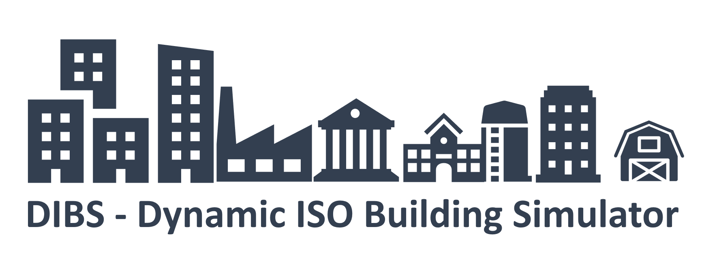

---
# Feel free to add content and custom Front Matter to this file.
# To modify the layout, see https://jekyllrb.com/docs/themes/#overriding-theme-defaults

layout: home
---

# DIBS

Dynamic ISO Building Simulator (DIBS) is a simulation program for calculating the space heating, occupancy hot water, cooling and electricity demand of German non-residential buildings. Further the DIBS calculates the heating value based energy uses, the primary energy and the greenhouse gas emission based on the defined factors of the German building energy ordinance (Gebäudeenergiegesetz). The adapted hourly dynamic building energy simulator for single buildings and building stocks is ready to use with [ENOB:dataNWG interview](https://www.datanwg.de/stichprobenerhebung/breitenerhebung) and [on-site inspection](https://www.datanwg.de/stichprobenerhebung/tiefenerhebung) data. The underlying resistance-capacity-model is based on the simplified hourly method of ISO 13790:2008. DIBS is based on the [RC_BuildingSimulator](https://github.com/architecture-building-systems/RC_BuildingSimulator) and represents an extension of capabilities and adaptation to the requirements of the ENOB:dataNWG project.

The Dynamic ISO Building Simulator has been developed in context of the 'ENOB:DataNWG Forschungsdatenbank Nichtwohngebäude' (www.datanwg.de) project and the project 'FlexGeber - Demonstration of flexibility options in the building sector and their integration with the energy system in Germany' at Institut Wohnen und Umwelt (IWU), Darmstadt.

<b>ENOB:DataNWG<b>
<b>Funding code:</b>  Fkz.: 03ET1315  
<b>Project duration:</b>  01.12.2015 until 31.05.2021

<b>FlexGeber<b>
<b>Funding code:</b>  Fkz.: 03EGB0001  
<b>Project duration:</b>  01.10.2017 until 31.07.2022

<b>ENOB:LezBAU<b>
<b>Funding code:</b>  Fkz.: 03EN1074A  
<b>Project duration:</b>  01.01.2023 until 31.12.2025

   

 